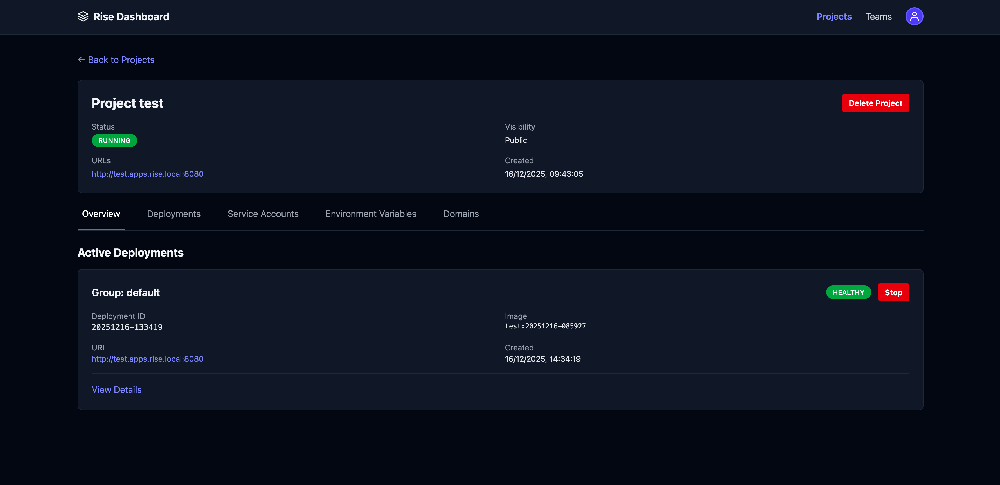

# Rise

<p align="center">
    
    <p align="center">A Rust-based platform for deploying containerized applications with minimal configuration.</p>
</p>

---

&nbsp;

> [!WARNING]
> **Early Work in Progress**
>
> This project is in a **very early experimental stage**. It is approximately **99% coded by Claude AI** (under technical guidance), which means:
> - The codebase is actively evolving and may contain bugs or incomplete features
> - APIs and interfaces may change frequently without notice
> - Documentation may be out of sync with the current implementation
> - Production use is **not recommended** at this stage
>
> If you choose to use or experiment with Rise, please be aware that you're working with experimental software. Contributions, bug reports, and feedback are welcome, but please set expectations accordingly.

## What is Rise?

Rise simplifies container deployment by providing:
- **Simple CLI** for building and deploying apps
- **Multi-tenant projects** with team collaboration
- **OAuth2 authentication** via Dex
- **Multiple registry backends** (AWS ECR, Docker)
- **Service accounts** for CI/CD integration
- **Web dashboard** for monitoring deployments

## Features

- **Project & Team Management**: Organize apps and collaborate with teams
- **OAuth2/OIDC Authentication**: Secure authentication via Dex
- **Multi-Registry Support**: AWS ECR, Docker Registry (Harbor, Quay, etc.)
- **Service Accounts**: Workload identity for GitHub Actions, GitLab CI
- **Multiple Build Backends**: Docker, Buildpacks, Railpack with build-time configuration
- **Multi-Process Architecture**: Separate controllers for deployments, projects, ECR
- **Embedded Web Frontend**: Single-binary deployment with built-in UI

## Quick Start

### Prerequisites

- Docker and Docker Compose
- Rust 1.91+
- [mise](https://mise.jdx.dev/) (recommended for development)

### Start Services

```bash
# Install development tools
mise install

# Start all services (postgres, dex, registry, backend)
mise backend:run
```

Services will be available at:
- **Backend API**: http://localhost:3000
- **Web UI (production-style)**: http://localhost:3000
- **Web UI (development, proxied to Vite)**: http://rise.local:3000
- **PostgreSQL**: localhost:5432

For local UI development, add this host mapping if missing:

```text
127.0.0.1 rise.local
```

**Default credentials**:
- Email: `admin@example.com` or `test@example.com`
- Password: `password`

### Build and Use CLI

```bash
# Build the CLI from source
cargo build --bin rise

# Build frontend bundle for embedding in the backend
mise frontend:build

# The CLI is now available as 'rise' (if using direnv)
# Or use the full path: ./target/debug/rise

rise login
rise project create my-app
rise deployment create my-app --image nginx:latest

# Local development
rise run --project my-app  # Build and run locally with project env vars

# Build with custom build-time variables (for build configuration)
rise build myapp:latest -e NODE_ENV=production -e BUILD_VERSION=1.2.3

# Or configure in rise.toml
cat > rise.toml <<EOF
[build]
backend = "pack"
env = ["NODE_ENV=production", "BP_NODE_VERSION=20"]
EOF
```

### Install from crates.io

```bash
# Install the CLI and backend from crates.io
cargo install rise-deploy

# Verify installation
rise --version
```

## Documentation

Full documentation is available in [`/docs`](./docs):

- [Setup](docs/user-guide/setup.md) - Quick start guide
- [Local Development](docs/development.md) - Development workflow
- [CLI Guide](docs/user-guide/cli.md) - Command-line usage
- [Authentication](docs/user-guide/authentication.md) - OAuth2 & service accounts
- [Deployments](docs/user-guide/deployments.md) - Deployment lifecycle
- [Building Images](docs/user-guide/builds.md) - Docker, pack, railpack
- [Configuration](docs/configuration.md) - Backend configuration
- [Container Registries](docs/user-guide/registries.md) - Registry usage in app workflows
- [Kubernetes](docs/kubernetes.md) - K8s deployment backend
- [Production Deployment](docs/production.md) - Production setup
- [Database](docs/database.md) - PostgreSQL & migrations
- [Testing](docs/testing.md) - Testing strategies
- [Troubleshooting](docs/user-guide/troubleshooting.md) - Common issues

## Architecture

Rise uses a multi-process architecture:

| Component | Purpose |
|-----------|---------|
| **rise-backend (server)** | HTTP API with embedded web frontend |
| **rise-backend (controllers)** | Deployment, project, and ECR reconciliation |
| **rise (CLI)** | Command-line interface |
| **PostgreSQL** | Database for projects, teams, deployments |
| **Dex** | OAuth2/OIDC provider for authentication |


## Project Status

**Production Ready**:
- ✅ OAuth2 PKCE authentication
- ✅ Project & team management
- ✅ Service accounts (workload identity for CI/CD)
- ✅ AWS ECR integration with Terraform module
- ✅ Kubernetes controller with Ingress authentication
- ✅ Build integrations (Docker, Buildpacks, Railpack)
- ✅ Embedded web frontend
- ✅ Deployment rollback and expiration

**In Development**:
- 🚧 Additional registry providers (GCR, ACR, GHCR)

## Contributing

Contributions are welcome! See [Local Development](docs/development.md) for development setup, code style, testing, and commit conventions.

## License

[Add your license here]
